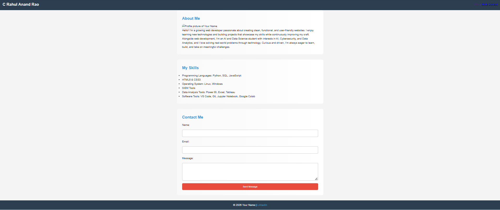
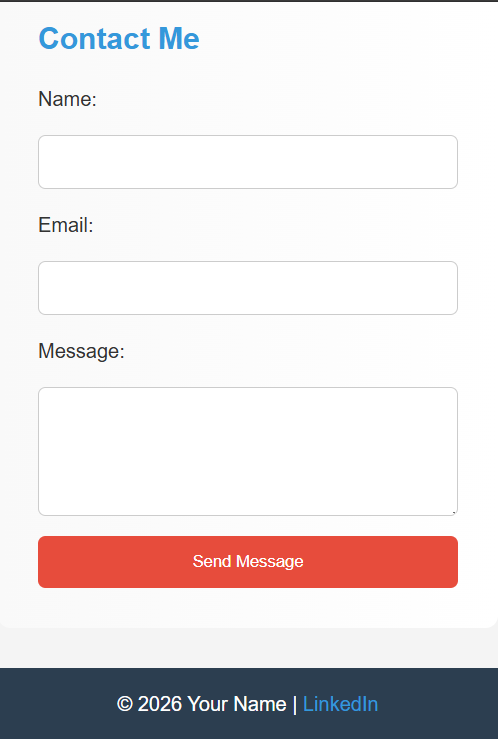
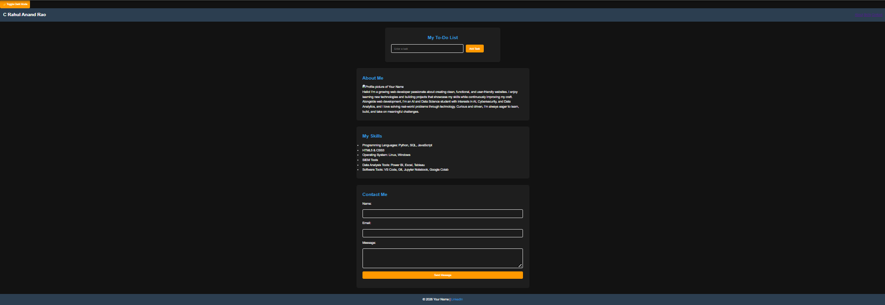
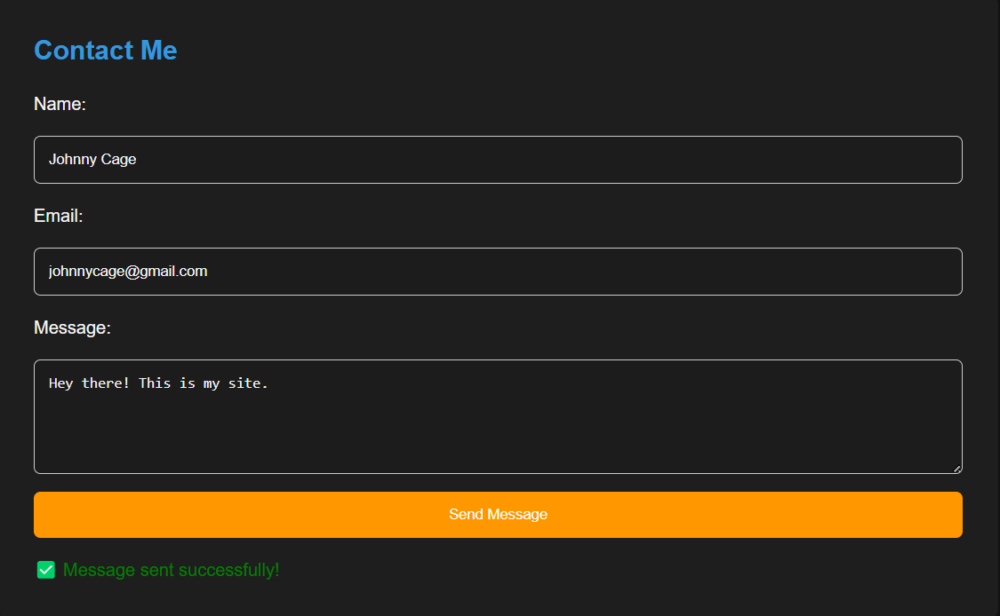
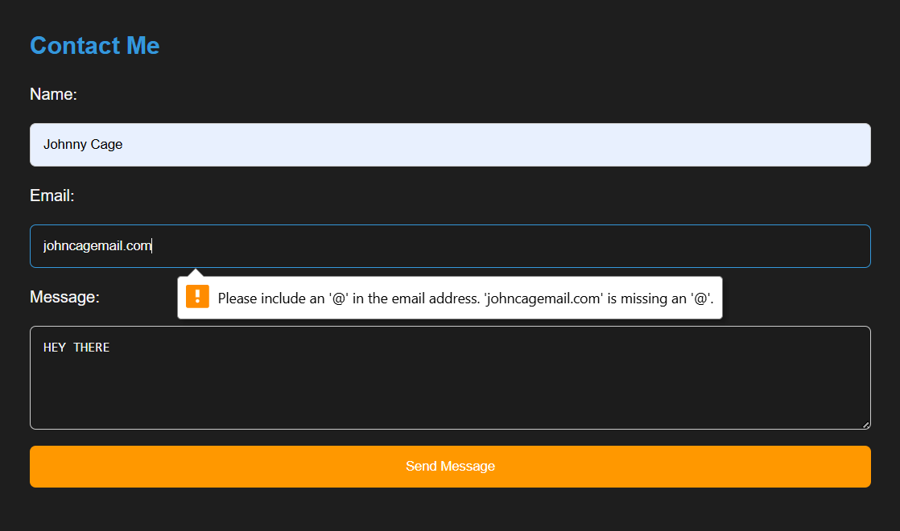
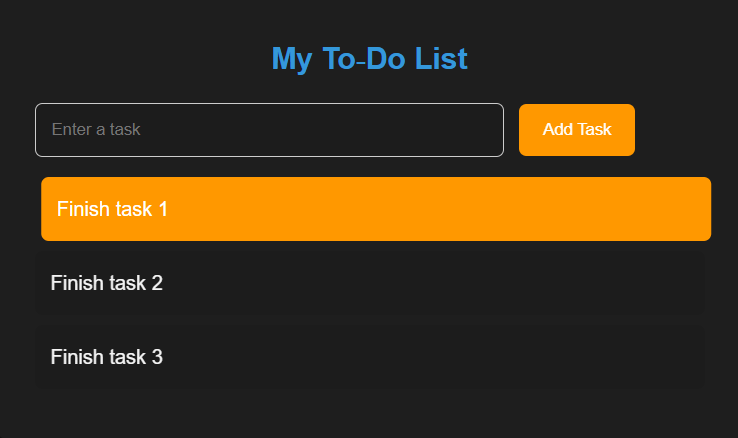

# Personal Portfolio Website

## Week 1
##  Project Overview
This project is a simple personal portfolio website built with **HTML5**.  
It showcases my personal information, skills, and includes a contact form.  
The goal is to demonstrate basic web development concepts and create a foundation for future styling and enhancements.


##  Setup Instructions
1. Clone the repository:
   ```bash
   git clone https://github.com/Johnny-Cage04/personal-portfolio.git

2. Navigate into the project folder: cd personal-portfolio

3. Open index.html in your browser to view the site.


##  Code Structure
1. `index.html` → Main webpage with sections (About, Skills, Projects, Contact).

2. `images/` → Contains profile picture and screenshots.

3. `README.md` → Documentation file.


## Visual Documentation
### Homepage 

### About Section 
 
### Skills Section 
 
### Contact Form 


## Technical Details
1. Semantic HTML tags used: `<header>`, `<nav>`, `<main>`, `<section>`, `<footer>`.

2. Internal navigation links with `href="#section-id"`.

3. Contact form includes validation (`required`, `type="email"`).

4. Accessibility ensured with `alt` text for images.

## Testing Evidence
1. Navigation links jump to correct sections.

2. Contact form prevents submission if fields are empty.

3. HTML validated successfully with W3C Validator.

## Week 2 
## CSS Concepts Used
1. Reset styles: Removed default browser margins/padding with `* { margin:0; padding:0; box-sizing:border-box; }`.

2. Typography: Integrated Google Fonts (Poppins) for a clean, modern look.

3. Color scheme: Defined reusable CSS variables (`--primary-color`, `--secondary-color`, `--accent-color`) for consistent styling.

4. Flexbox layout: Used for header, skills, and projects sections to align and distribute elements.

5. Media queries: Implemented responsive design with `@media (max-width:768px)` to stack elements on smaller screens.

6. Transitions & hover effects: Added smooth animations for navigation links, buttons, and project cards.

7. Smooth scrolling: Enabled with `html { scroll-behavior: smooth; }`.

8. Advanced styling: Rounded corners, shadows, gradient backgrounds, and fade‑in animations for headings.


## Design Decisions
1. Modern aesthetic: Rounded corners, subtle shadows, and gradients for a professional feel.

2. Color psychology: Blue (`--primary-color`) for trust, red (`--accent-color`) for highlights, dark gray (`--secondary-color`) for stability.

3. Interactive UX: Hover effects and transitions to make navigation and cards feel dynamic.

4. Consistency: CSS variables ensure uniform colors across all sections.


## Responsiveness Approach
Flexbox with wrapping: `.skills-container` and `.projects-container` use `flex-wrap` to adapt to screen width.

Media queries: Switch layouts from row → column on mobile for readability.

Testing: Verified responsiveness in Chrome DevTools (desktop, tablet, mobile views).


## Code Structure (Updated)
1. `index.html` → Main webpage with About, Skills, Contact (Projects section optional).

2. `style.css` → Complete styling including Flexbox, responsiveness, hover effects, advanced polish.

3. `images/` → Profile photo and project thumbnails.

4. `screenshots/` → Desktop and mobile screenshots for documentation.

5. `README.md` → Expanded documentation with Week 1 + Week 2 updates.


## Visual Documentation
### Desktop View

### Mobile View





## Technical Details
Architecture: Semantic HTML structure (`<header>`, `<nav>`, `<main>`, `<section>`, `<footer>`).

CSS layout: Flexbox for alignment, media queries for responsiveness.

Interactive elements: Transitions, hover effects, smooth scrolling.

Accessibility: Alt text for images, semantic tags for screen readers.


## Testing Evidence
1. Navigation links scroll smoothly to correct sections.

2. Contact form validates required fields and email format.

3. Hover effects and transitions work consistently across browsers.

4. Responsive layout verified in Chrome, Edge, and Firefox.

5. HTML validated successfully with W3C Validator.


## Week 3 
## JavaScript Concepts Used
1. Client-side scripting for interactivity.

2. Functions & Event Handling (`toggleDarkMode`, `validateForm`, `addTask`).

3. DOM Manipulation (footer year, form feedback, to‑do list items).

4. Event Listeners (click, submit).

5. Form Validation with real-time feedback.

6. Local Storage for dark mode preference.


## Interactive Features Implemented
1. Dark/Light Mode Toggle: Button switches themes, preference saved in localStorage.

2. Dynamic Footer Year: Footer year updates automatically using new `Date().getFullYear()`.

3. Form Validation: Validates email format and message length, shows error/success messages.

4. To‑Do List: Add tasks via input, tasks appear instantly, clicking removes them.


## Code Structure (Updated)
1. `index.html` → Main webpage with About, Skills, Contact, To‑Do List.

2. `style.css` → Styling including dark mode, responsiveness, to‑do list styles.

3. `script.js` → JavaScript interactivity (dark mode, form validation, to‑do list, footer year).

4. `images/` → Profile photo and screenshots.

5. `README.md` → Documentation with Week 1, Week 2, Week 3 updates.


## Visual Documentation
### Dark Mode Toggle

### Footer Year

### Form Validation


### To-Do List



## Technical Details
1. Dynamic Footer Year:
   ```bash
   document.getElementById("year").textContent = new Date().getFullYear();

2. Dark Mode Toggle:
   ```bash
   function toggleDarkMode() {
      document.body.classList.toggle("dark-mode");
      localStorage.setItem("darkMode", document.body.classList.contains("dark-mode"));
   }

3. Form Validation:
   ```bash
   if (!email.includes("@")) {
     showError("Please enter a valid email address");
   }
   if (message.length < 10) {
     showError("Message must be at least 10 characters");
   }

4. To-Do List:
   ```bash
   function addTask() {
    const taskInput = document.getElementById("taskInput");
    const taskList = document.getElementById("taskList");

    if (taskInput.value.trim() !== "") {
       const li = document.createElement("li");
       li.textContent = taskInput.value;
       li.onclick = () => li.remove();
       taskList.appendChild(li);
       taskInput.value = "";
       }
   }

## Testing Evidence
1. Form Validation: Invalid email → error; short message → error; valid input → success.

2. Dark Mode: Toggle button switches theme; preference persists after refresh.

3. Footer Year: Displays current year automatically.

4. To‑Do List: Add task → appears; click task → removed.