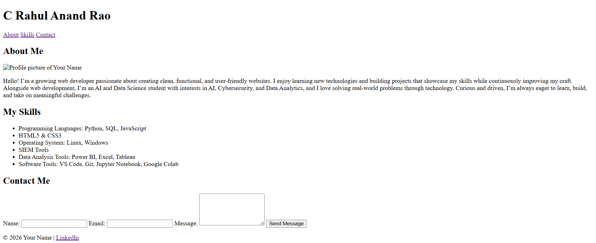
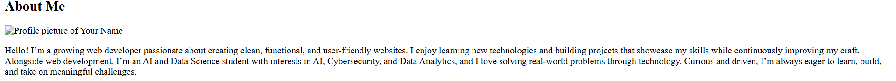
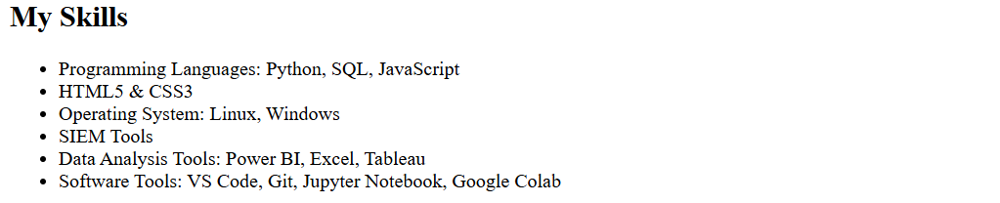
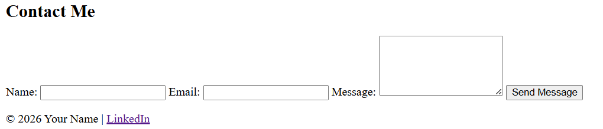

# Personal Portfolio Website

## 📌 Project Overview
This project is a simple personal portfolio website built with **HTML5**.  
It showcases my personal information, skills, and includes a contact form.  
The goal is to demonstrate basic web development concepts and create a foundation for future styling and enhancements.


## ⚙️ Setup Instructions
1. Clone the repository:
   ```bash
   git clone https://github.com/Johnny-Cage04/personal-portfolio.git

2. Navigate into the project folder: cd personal-portfolio

3. Open index.html in your browser to view the site.


## 📂 Code Structure
1. index.html → Main webpage with sections (About, Skills, Projects, Contact).

2. images/ → Contains profile picture and screenshots.

3. README.md → Documentation file.


## 🖼️ Visual Documentation
### Homepage 

### About Section 
 
### Skills Section 
 
### Contact Form 



## 📖 Technical Details
1. Semantic HTML tags used: `<header>`, `<nav>`, `<main>`, `<section>`, `<footer>`.

2. Internal navigation links with `href="#section-id"`.

3. Contact form includes validation (`required`, `type="email"`).

4. Accessibility ensured with `alt` text for images.

## ✅ Testing Evidence
1. Navigation links jump to correct sections.

2. Contact form prevents submission if fields are empty.

3. HTML validated successfully with W3C Validator.